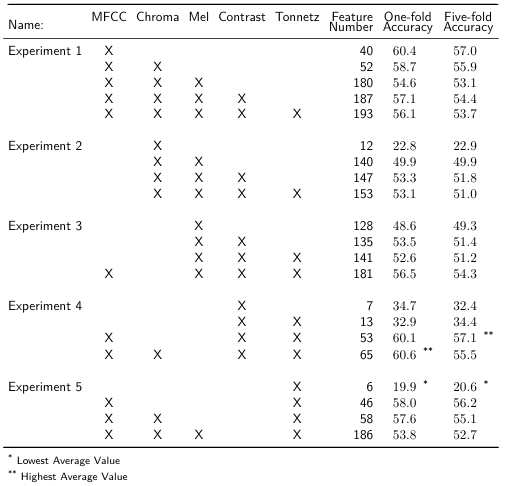
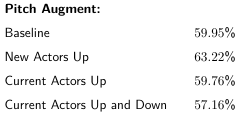
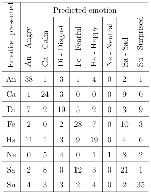
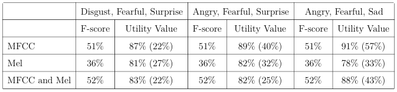

# Speech Emotion Recognizer

This project implements a speech emotion recognition system using machine learning models, designed to classify emotions from audio recordings based on features extracted from speech signals.

The research began with a series of baseline tests that established foundational performance metrics for the system. Following this, an enhancement strategy was employed, wherein sound samples were augmented by adjusting the pitch to improve classification accuracy.

To evaluate the system's performance further, a confusion matrix was generated. This analysis highlighted how different emotions were affected during classification, providing insights into potential areas for improvement.

Lastly, this research proposes a utility value as an alternative metric to traditional performance measures, specifically tailored to account for the variability and convolution of emotions.

## Features

- **Extracted Speech Features**:
  - MFCC (Mel-frequency cepstral coefficients)
  - Chroma
  - MEL Spectrogram Frequency
  - Spectral Contrast
  - Tonnetz

- **Models**:
  - Random Forest
  - K-Nearest Neighbors (KNN)
  - Support Vector Machine (SVM)
  - Multi-Layer Perceptron (MLP)
  - Naive Bayes

## Dataset

The project uses the [RAVDESS dataset](https://www.kaggle.com/uwrfkaggler/ravdess-emotional-speech-audio) for training and testing. It includes audio files labeled with various emotions.

## How It Works

1. **Extracting Features**: The system extracts the following features from each audio file:
   - MFCC
   - Chroma
   - MEL
   - Spectral Contrast
   - Tonnetz

2. **Emotion Classification**: Based on the extracted features, different models are trained to classify the emotions in the audio. The following emotions are supported:
   - Calm
   - Happy
   - Sad
   - Disgust
   - Angry
   - Fearful
   - Surprised

3. **Results**: The system calculates the accuracy, utility value, and confusion matrix for the selected emotion classifications. The results are saved into an Excel file for analysis.
